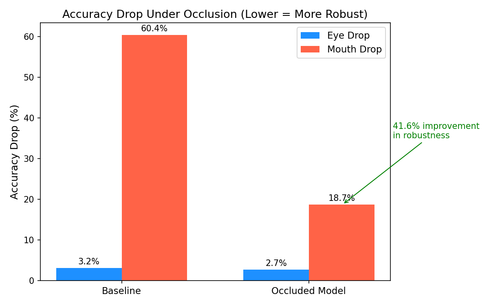
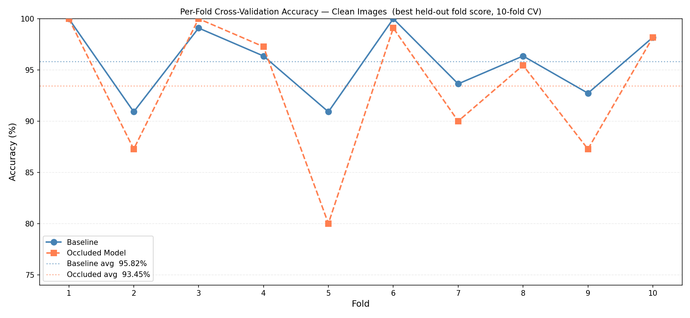
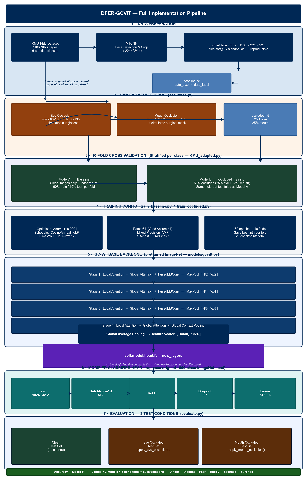
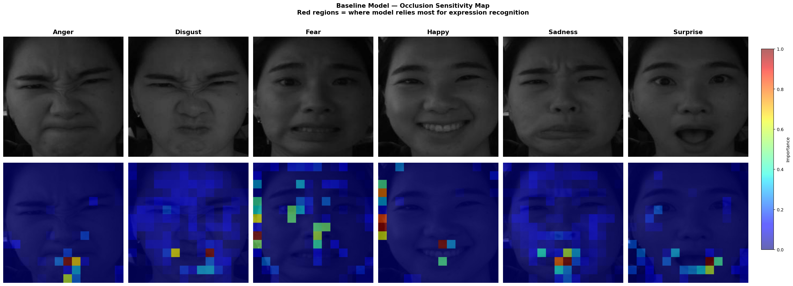
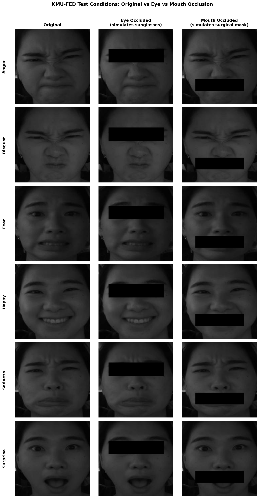

# Occlusion-Robust Driver Facial Expression Recognition using GC-ViT

**TL;DR:** Mouth occlusion caused a 60.36 percentage point accuracy drop in the baseline DFER-GCViT model. Training with 50% synthetically occluded images reduced that drop to 18.73 pp, a 41.6 pp recovery, with only 2.37 pp cost on clean accuracy.

---

## Table of Contents

- [Why This Matters](#why-this-matters)
- [Key Results](#key-results)
- [Methodology](#methodology)
- [Where the Model Looks](#where-the-model-looks)
- [Test Conditions](#test-conditions)
- [Model Architecture](#model-architecture)
- [Quick Start](#quick-start)
- [Training Setup](#training-setup)
- [Technology Stack](#technology-stack)
- [Project Structure](#project-structure)
- [Cite This Work](#cite-this-work)
- [References](#references)

---

## Why This Matters

Facial expression recognition in driver monitoring systems is tested on clean images in controlled settings. In practice, drivers wear surgical masks, sunglasses, and scarves. Systems that perform well on clean data can fail completely under partial occlusion.

The DFER-GCViT model (Saadi et al., IEEE CVMI 2023) reported 98.27% accuracy on the KMU-FED near-infrared dataset but was never evaluated under occlusion. This study fills that gap. It reimplements the architecture using the GC-ViT Base backbone via timm, tests it under synthetic eye and mouth occlusion, and trains an occlusion-aware variant to measure how much robustness can be recovered.

This matters for any real-world deployment of driver monitoring systems in vehicles, especially under post-pandemic conditions where mask usage remains common.

---

## Key Results

|  | Model A (Baseline) | Model B (Occluded) |
|--|:--:|:--:|
| Clean Accuracy | 95.82% | 93.45% |
| Eye Occluded | 92.64% | 90.73% |
| Mouth Occluded | 35.45% | 74.73% |
| Eye Drop | 3.18 pp | 2.73 pp |
| **Mouth Drop** | **60.36 pp** | **18.73 pp** |

All values are averaged over 10 folds. Full per-fold results are in `results/evaluation.csv`.




**Key findings:**
- Mouth occlusion is catastrophic for the baseline. Expressions driven by mouth signals (Happy, Anger, Surprise) fail almost completely.
- Eye occlusion barely affects either model. GC-ViT global attention compensates using other facial regions.
- Occlusion-aware training (Model B) recovers 41.6 pp of robustness at a cost of only 2.37 pp on clean accuracy.

---

## Methodology



**Dataset:** KMU-FED (Jeong and Ko, Sensors 2018) — 1,106 near-infrared driver face images across 6 emotion classes (Anger, Disgust, Fear, Happy, Sadness, Surprise). Face regions detected and cropped to 224x224 using MTCNN.

**Synthetic Occlusion:** Black rectangles applied programmatically to simulate real-world occlusions. Total augmented training set: 3,318 images.

```python
def apply_eye_occlusion(image):      # simulates sunglasses
    occluded = image.copy()
    occluded[60:100, 30:195] = 0
    return occluded

def apply_mouth_occlusion(image):    # simulates surgical mask
    occluded = image.copy()
    occluded[150:185, 40:185] = 0
    return occluded
```

**Two Models:**
- **Model A** trains on clean images only
- **Model B** trains on 50% occluded images (25% eye, 25% mouth per class)

**Evaluation:** Both models tested on three conditions: clean, eye-occluded and mouth-occluded. Occlusion applied in memory at test time from the clean baseline HDF5 file. 10-fold stratified cross-validation throughout.

---

## Where the Model Looks

Occlusion sensitivity maps reveal which face regions Model A relies on for each emotion class. A 16x16 sliding patch occludes each region in turn and measures how much the model's confidence drops. Red regions are the most critical.



Mouth dominance in Happy, Anger and Surprise is the direct cause of the 60.36 pp accuracy drop when the mouth is blocked. This also explains why eye occlusion has almost no effect — the model does not rely on the eye region heavily for most classes.

---

## Test Conditions

The three conditions both models are evaluated on:



---

## Model Architecture

GC-ViT Base backbone (pretrained on ImageNet via timm) with a modified 5-layer classifier head replacing the original fully connected layer.

```
NIR Face Image (224x224)
        |
   MTCNN Crop
        |
 GC-ViT Base Backbone
   Stage 1: Local Attention + Global Attention + FusedMBConv + MaxPool
   Stage 2: Local Attention + Global Attention + FusedMBConv + MaxPool
   Stage 3: Local Attention + Global Attention + FusedMBConv + MaxPool
   Stage 4: Local Attention + Global Attention + Global Context
        |
 Global Average Pooling  [Batch, 1024]
        |
 Modified Classifier Head
   Linear(1024 -> 512)
   BatchNorm1d(512)
   ReLU
   Dropout(0.5)
   Linear(512 -> 6)
        |
 Anger | Disgust | Fear | Happy | Sadness | Surprise
```

The head is attached in one line in `models/gcvitt.py`:
```python
self.model.head.fc = new_layers
```

---

## Quick Start

```bash
pip install -r requirements.txt
```

```bash
# Step 1: Build HDF5 dataset from raw KMU-FED images
python preprocess_kmu.py

# Step 2: Train Model A — clean images, 10 folds
cd extension
python train_baseline.py

# Step 3: Train Model B — occluded images, 10 folds
python train_occluded.py

# Step 4: Evaluate both models
python evaluate.py

# Step 5: Generate all 8 charts
python visualise.py
```

> HDF5 files (`KMUtada/baseline.h5`, `KMUtada/occluded.h5`) and model checkpoints (`results/**/*.pth`) are not included in this repo as they exceed GitHub file size limits. Run the scripts above to regenerate them from your local KMU-FED dataset.

---

## Training Setup

| Setting | Value |
|---------|-------|
| Optimizer | Adam |
| Learning rate | 0.0001 |
| LR Schedule | CosineAnnealingLR (T_max=60, eta_min=1e-6) |
| Batch size | 64 effective (gradient accumulation 16x4) |
| Epochs | 60 |
| Folds | 10-fold stratified cross-validation |
| Precision | Mixed (AMP fp16 + fp32) |
| Hardware | NVIDIA RTX 3070 8GB, AMD Ryzen 9 5900 HS |

Gradient accumulation (4 steps of 16) was used because GC-ViT Base with batch size 64 exceeds 8 GB VRAM.

---

## Technology Stack

| Tool | Purpose |
|------|---------|
| Python 3.10 | Core language |
| PyTorch 2.x | Training and inference |
| timm | GC-ViT Base pretrained backbone |
| facenet-pytorch | MTCNN face detection and crop |
| h5py | HDF5 data storage |
| scikit-learn | F1 score, confusion matrix |
| matplotlib | All 8 visualisation charts |
| numpy | Image manipulation |
| CUDA / AMP | Mixed precision training |

---

## Project Structure

```
dfer-gcvit-occlusion-robustness/
|
+-- models/
|   +-- gcvitt.py              GC-ViT Base + modified classifier head
|
+-- extension/
|   +-- KMU_adapted.py         Dataset class with 10-fold split logic
|   +-- occlusion.py           Eye and mouth occlusion functions
|   +-- train_baseline.py      Train Model A (clean images)
|   +-- train_occluded.py      Train Model B (occluded images)
|   +-- evaluate.py            Evaluate both models under 3 conditions
|   +-- visualise.py           Generate all 8 charts
|
+-- KMU.py                     Original dataset class
+-- preprocess_kmu.py          MTCNN pipeline to HDF5
+-- mainKMU.py                 Original training script
+-- matrixconKMU.py            Confusion matrix script
|
+-- results/
|   +-- evaluation.csv         2 models x 3 conditions x 10 folds
|   +-- baseline/fold_results.csv
|   +-- occluded/fold_results.csv
|
+-- visualisations/            8 PNG charts and diagrams
+-- Poster/                    Research poster PDF and PPTX
+-- requirements.txt
```

---

## Cite This Work

If you use this code or findings in your research, please cite:

```bibtex
@misc{padmanababu2025dfer,
  author    = {Padmanabhan Babu, Srimonchaari},
  title     = {Occlusion-Robust Driver Facial Expression Recognition using GC-ViT},
  year      = {2025},
  publisher = {GitHub},
  url       = {https://github.com/Srimonchaari/dfer-gcvit-occlusion-robustness},
  note      = {Research module, BTU Cottbus-Senftenberg, Faculty of Graphical Systems}
}
```

---

## References

1. Saadi et al. (2023). Driver's Facial Expression Recognition using Global Context Vision Transformer. IEEE CVMI 2023. https://doi.org/10.1109/CVMI59935.2023.10464794
2. Hatamizadeh et al. (2022). Global Context Vision Transformers. arXiv:2206.09959. https://arxiv.org/abs/2206.09959
3. Jeong and Ko (2018). Driver's facial expression recognition in real-time for safe driving. Sensors, 18(12), 4270. https://doi.org/10.3390/s18124270

---

**Supervisors:** Dr. Ibtissam Saadi (first supervisor) and Prof. Douglas W. Cunningham, BTU Cottbus-Senftenberg.

For academic research use only. KMU-FED dataset terms apply.
